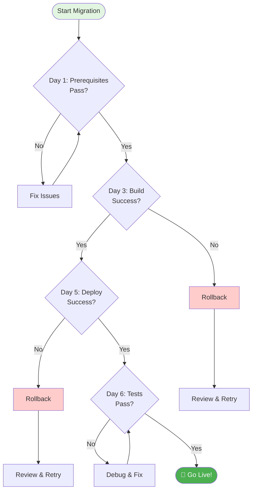

# Visual Migration Roadmap

## 7-Day Journey: Localhost → LAN Production

```mermaid
graph LR
    subgraph "Current State"
        L[🖥️ Localhost:3737]
    end
    
    subgraph "Day 1-2: Foundation"
        P[✓ Prerequisites] --> E[🔧 Environment]
        E --> C[📝 Configuration]
    end
    
    subgraph "Day 3-4: Build"
        C --> D[🐳 Docker Compose]
        D --> T[🔀 Traefik Labels]
        T --> B[🏗️ Build Images]
    end
    
    subgraph "Day 5-6: Deploy"
        B --> UP[🚀 Deploy]
        UP --> R[🌐 Routing]
        R --> TEST[🧪 Testing]
    end
    
    subgraph "Day 7: Launch"
        TEST --> V[✅ Validation]
        V --> DOC[📚 Documentation]
        DOC --> LIVE[🎯 Go Live]
    end
    
    subgraph "Future State"
        LIVE --> A[🌟 archon.mcdonaldhomelab.com]
    end
    
    L -.->|Migration Path| P
    
    style L fill:#ffcccc
    style A fill:#ccffcc
    style LIVE fill:#ffff99
```



---

## Phase Breakdown Timeline

### 📅 Week Overview

| Mon | Tue | Wed | Thu | Fri | Sat | Sun |
|-----|-----|-----|-----|-----|-----|-----|
| **Day 1** | **Day 2** | **Day 3** | **Day 4** | **Day 5** | **Day 6** | **Day 7** |
| 🔍 Verify | 🔧 Setup | 🐳 Build | 🏗️ Config | 🚀 Deploy | 🧪 Test | 🎯 Launch |

---

## Detailed Phase Flow

```
Day 1: FOUNDATION PHASE ⚡ 2 hours
├── ✅ Traefik verification
├── 📋 Prerequisites check  
├── 🔑 Credentials gathering
├── 📁 Create .env.local and .env.lan templates
└── 💾 Backup current state
     ↓
Day 2-3: CONFIGURATION PHASE 🔧 4 hours
├── 📝 Modify docker-compose.yml for env variables
├── 🏷️ Add conditional Traefik labels
├── 🌐 Configure conditional networks
├── 📜 Create deploy.sh script
└── 🔐 Test environment switching
     ↓
Day 4-5: DEPLOYMENT PHASE 🚀 6 hours  
├── 🏗️ Test local mode with .env.local
├── 🆙 Switch to LAN mode with .env.lan
├── 🔀 Verify Traefik routing
├── 🔒 Confirm SSL certificates
└── ↩️ Test instant rollback capability
     ↓
Day 6: VALIDATION PHASE 🧪 3 hours
├── 👥 Multi-device access test
├── ⚡ Performance benchmarking
├── 🔄 Mode switching verification
└── 📊 Load testing (5 users)
     ↓
Day 7: COMPLETION PHASE ✅ 1 hour
├── 📚 Final documentation
├── 🎓 User quick-start guide
├── 🔍 Final health check
└── 🎉 Go-live announcement
```

---

## Risk Gates & Decision Points



---

## Parallel Workstreams

```
TECHNICAL TRACK                 OPERATIONAL TRACK
━━━━━━━━━━━━━━━                ━━━━━━━━━━━━━━━━━
                                  
Day 1: Environment Check    ║    Day 1: Gather Credentials
         ↓                  ║              ↓
Day 2: Docker Config        ║    Day 2: DNS Configuration  
         ↓                  ║              ↓
Day 3: Build Images         ║    Day 3: Network Rules
         ↓                  ║              ↓
Day 4: Traefik Labels       ║    Day 4: Monitoring Setup
         ↓                  ║              ↓
Day 5: Deploy Services      ║    Day 5: User Communication
         ↓                  ║              ↓
Day 6: Integration Test     ║    Day 6: Documentation Prep
         ↓                  ║              ↓
Day 7: Go Live ←───────────╬────────→ Day 7: Handover
```

---

## Success Milestones

| Milestone | Target | Indicator | Day |
|-----------|--------|-----------|-----|
| 🏁 **Ready to Build** | Prerequisites met, .env files created | Checklist 100% | 1 |
| 🔧 **Configuration Complete** | Deploy script working | Mode switching tested | 3 |
| 🐳 **Both Modes Working** | Local and LAN operational | Health checks green | 5 |
| ✅ **Tests Passing** | Instant rollback verified | <200ms response | 6 |
| 🎯 **Production Ready** | Documentation complete | Users accessing | 7 |

---

## Quick Status Dashboard

```
PROJECT: Archon LAN Migration
━━━━━━━━━━━━━━━━━━━━━━━━━━━━
Overall Progress: [░░░░░░░░░░] 0%

✅ Planning          [██████████] 100%
⏳ Prerequisites     [░░░░░░░░░░] 0%
⏳ Configuration     [░░░░░░░░░░] 0%
⏳ Deployment        [░░░░░░░░░░] 0%
⏳ Testing           [░░░░░░░░░░] 0%
⏳ Documentation     [░░░░░░░░░░] 0%

Next Action: Run Day-1 Checklist
Blockers: None
Risk Level: LOW 🟢
```

---

## Critical Path Activities

### Must Complete in Order:
1. **Day 1:** Traefik proxy verification
2. **Day 2:** DNS configuration
3. **Day 3:** Docker compose creation
4. **Day 4:** Traefik label configuration
5. **Day 5:** Service deployment
6. **Day 6:** Multi-device testing
7. **Day 7:** Go-live decision

### Can Run in Parallel:
- Documentation preparation (Day 2-6)
- Monitoring setup (Day 3-5)
- User communication (Day 5-7)
- Backup procedures (Day 1-3)

---

## Resource Allocation

| Day | Technical Hours | Operational Hours | Total |
|-----|----------------|------------------|-------|
| 1 | 1.5 | 0.5 | 2.0 |
| 2 | 2.0 | 0.5 | 2.5 |
| 3 | 2.0 | 0.5 | 2.5 |
| 4 | 2.0 | 0.5 | 2.5 |
| 5 | 2.0 | 1.0 | 3.0 |
| 6 | 2.0 | 1.0 | 3.0 |
| 7 | 0.5 | 0.5 | 1.0 |
| **Total** | **12.0** | **4.5** | **16.5** |

---

*Last updated: January 2025*  
*Project Code: ARCHON-LAN-001*